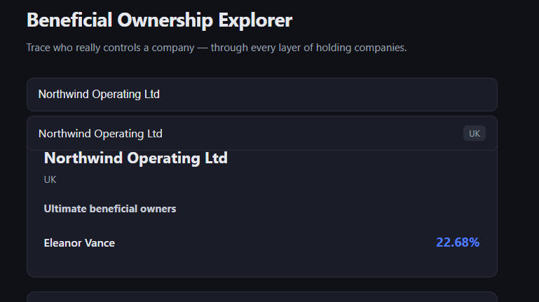
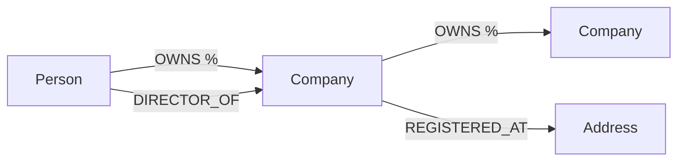
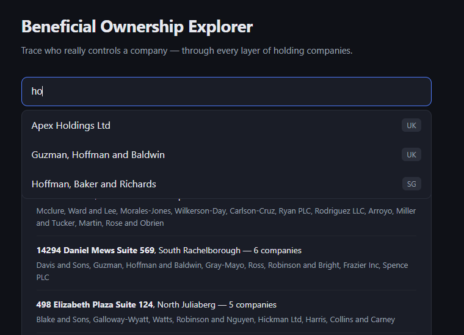
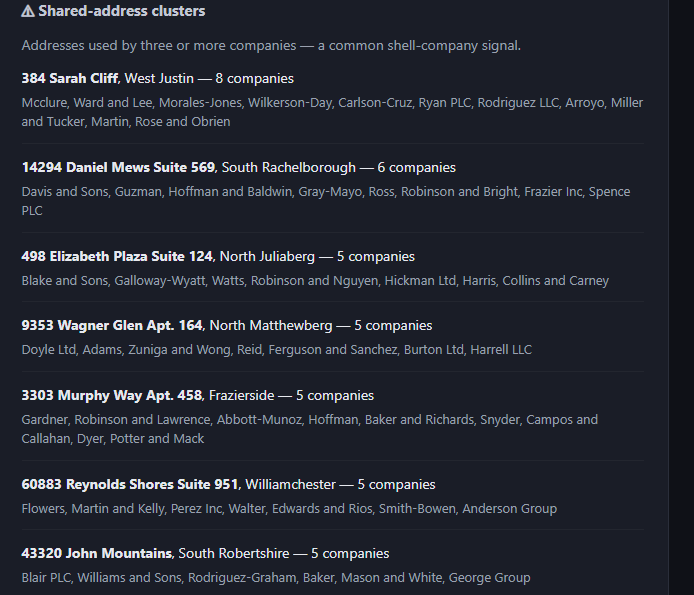

# Beneficial Ownership Explorer

Trace who *really* controls a company — through every layer of intermediary
holding companies — using a graph database.

Built with **CognoDB** (graph database, Neo4j-compatible over Bolt),
**FastAPI** (Python backend), and **React** (frontend).

> **Note:** All data is entirely fictional (generated with Faker). No real
> people, companies, or ownership records are used.

**Live demo:** https://ownership-explorer-chi.vercel.app/



---

## The problem

Company ownership is rarely direct. A person might own a company through a
chain of five other companies, each owning a fraction of the next. Working out
someone's *real* stake means following that chain and multiplying the
percentages at every step — and a person can be reached through several chains
at once, which then have to be added together.

This app answers: **"Given a company, who are its ultimate human owners, and
what is each one's true effective stake?"**

---

## Why a graph database?

This is the kind of question graphs exist for, and the reason is specific:

**The ownership chain is of unknown depth.** An owner might be 1 hop away or 8
hops away, behind any number of holding companies. In a relational database,
"follow ownership to an unknown depth" means a recursive self-join (a recursive
CTE) — joining the ownership table to itself an unpredictable number of times,
then manually multiplying percentages along each path and de-duplicating owners
reached by multiple routes. It's awkward, slow, and hard to read.

In a graph, the same question is one line:

```cypher
MATCH path = (owner:Person)-[:OWNS*1..10]->(target:Company {id: $id})
```

`[:OWNS*1..10]` means "follow OWNS relationships 1 to 10 hops deep." The
database walks the chains for you; the percentage maths is a single `reduce()`.

The second query — finding addresses shared by many companies (a shell-company
signal) — is also naturally a graph traversal to a shared `Address` node.

**In short:** the interesting questions here are about *paths and reachability
across relationships of unknown length*, not about filtering rows. That is
exactly where a graph earns its place over a relational schema.

---

## Data model

**Nodes**
- `Company` — id, name, jurisdiction, incorporation_date, status
- `Person` — id, name, nationality, birth_year
- `Address` — id, line, city, country

**Relationships**
- `(Person|Company)-[:OWNS {percent, since}]->(Company)`
- `(Person)-[:DIRECTOR_OF {role, appointed}]->(Company)`
- `(Company)-[:REGISTERED_AT {since}]->(Address)`



**One key modeling decision:** `OWNS` is a single relationship type used by both
`Person` and `Company` (rather than two separate types). This is deliberate —
it lets the ownership chain be traversed in one clean variable-length pattern
`[:OWNS*1..10]` that passes *through* corporate owners and *ends* at a person.
`Address` is modeled as a node (not a property) precisely because "companies
sharing an address" is one of the questions we care about — the shared node is
the answer. Country/jurisdiction stay as properties, since grouping thousands of
companies under one country node would create a supernode with no query value.

---

## Main queries

**1. Effective beneficial ownership** (the headline query)
Walks ownership chains up to 10 hops, multiplies the percentage along each path,
and sums across multiple paths to the same owner:

```cypher
MATCH path = (owner:Person)-[:OWNS*1..10]->(target:Company {id: $id})
WITH owner, reduce(pct = 1.0, r IN relationships(path) | pct * r.percent) AS effective
RETURN owner.name AS owner, sum(effective) AS effectiveOwnership, count(*) AS pathCount
ORDER BY effectiveOwnership DESC
```

Example: an owner holding 90% → 80% → 75% → 70% → 60% down a five-company chain
has an effective stake of 0.9 × 0.8 × 0.75 × 0.7 × 0.6 = **22.68%**. Searching a
company earlier in the chain shows the same owner with a higher stake (fewer
layers of dilution).



**2. Shared-address clusters** (shell-company signal)
Finds any address used by three or more companies:

```cypher
MATCH (a:Address)<-[:REGISTERED_AT]-(c:Company)
WITH a, collect(c.name) AS companies, count(c) AS companyCount
WHERE companyCount >= 3
RETURN a.line AS address, a.city AS city, companyCount, companies
ORDER BY companyCount DESC
```



**3. Company search** — case-insensitive name lookup powering the search box.

All queries are parameterised through the official Neo4j driver — no
string-concatenated Cypher.

---

## Setup & run

### 1. Create a CognoDB instance
- Sign up at https://console.cognodb.com/signup (free tier, no card).
- Create a free `c0` instance; save the `bolt+s://` URI, username `cognodb`,
  and generated password.

### 2. Backend
```bash
cd backend
python -m venv venv
venv\Scripts\activate          # Windows; use source venv/bin/activate on Mac/Linux
pip install -r requirements.txt
```
Create `backend/.env` (see `.env.example`):
NEO4J_URI=bolt+s://<instance-id>.databases.cognodb.cloud
NEO4J_USER=cognodb
NEO4J_PASSWORD=<your-password>

Load the data, then start the API:
```bash
python seed.py
uvicorn main:app --reload
```

### 3. Frontend
```bash
cd frontend
npm install
```
Create `frontend/.env`:
VITE_API_URL=http://localhost:8000
```bash
npm run dev
```
Open http://localhost:5173.

---

## Architecture
- `backend/db.py` — creates the Neo4j driver once, shared across requests.
- `backend/main.py` — API endpoints; every DB call is wrapped to return a clean
  503 if the database is unreachable.
- `backend/seed.py` — generates synthetic data and loads it via parameterised,
  bulk `UNWIND` queries. Deterministic (seeded) and idempotent.
- `frontend/src/api.js` — all backend calls in one place.
- `frontend/src/App.jsx` — search, ownership panel, shared-address clusters,
  with loading / empty / error states.

---

## Notes on the data

All names, companies, and addresses are **randomly generated with Faker and are
entirely fictional**. Any resemblance to real people or companies is
coincidental, and no real personal or ownership data is used anywhere in this
project.

The dataset is sized for the free tier (~114 nodes) and deliberately includes a
deep ownership chain, a circular ownership loop, a shared-address shell cluster,
and a "diamond" (one owner reaching a company via two paths) so that every query
has a clear, demonstrable result.

## Future work
- Visual node-link rendering of ownership chains (e.g. React Flow).
- Shortest-path "how are these two entities connected?" queries.
- Real data ingestion (e.g. UK Companies House PSC data).
